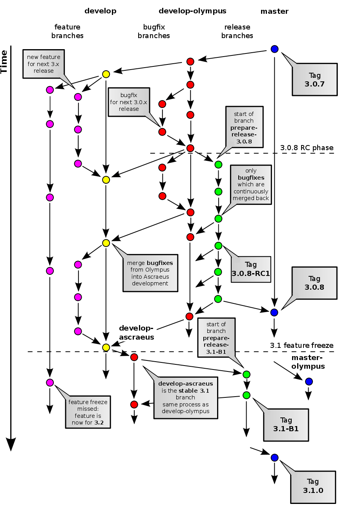

#Introdução

Isso não é um tutorial básico sobre git. Tento atacar as principais dúvidas que me surgiram quando comecei a utilizar o Git: fluxo do git, branch e merge.

Esses três assuntos eu tento demonstrar com foco no processo de desenvolvimento, não apenas no poder da ferramenta.

#Fluxo Git
Um repositório git não depende de um repositório remoto. Todo o controle das alterações está na sua mão, localmente. Então a primeira dica é ter o fluxo de um repositório git na mente: 


"staging area" or "index"


Fluxo com o repositório remoto


#Branch

Criar alteranando `git checkout -b nome_branch`

Para ver branches remotas: `git branch -r`

Baixar uma branch remota e ligar com uma branch local: `git checkout -t origin/nome_branch` ou `git branch -t nome_branch origin/nome_branch`

Apagar remotas: `git push origin :nome_branch`


##Diff

Para mostrar a diferença entre alterações e commits: `git diff`

Diferença entre staged e HEAD: `git diff --cached`

Mostrar a diferença entre dois branches `git diff nome_b1 nome_b2`

##Stash

Como o próprio nome diz, esconde. Esconde uma alteração, retirando-a do working directory e/ou index e colocando numa área com um label para acessá-la de novo.

Útil quando se quer salvar uma alteração urgente e voltar o código ao original antes de uma correção de emergência.

- `git stash` - esconde
- `git stash list` - mostra áreas escondidas
- `git stash pop` - recupera a última área
- `git stash apply [stash name]` - volta área específica
- `git stash drop` --> apaga uma área
- `git stash clear` --> apaga todos os estados.

#Merge

```
#!bash
git checkout master
git pull origin master
git checkout b1
git rebase master
```

Troca tudo isso por `git pull --rebase origin master` na própria branch _b1_.

Se houver conflitos, após arrumá-los: `git rebase --continue`


## Conflitos
Não tem jeito, tem que resolver os conflitos manualmente. Mas quais?

`git diff --name-only --diff-filter=U`


#Processo de desenvolvimento





#Veja também
- Alias
- github.io
- [Documento de introdução ao Git do Paulistano](https://goo.gl/xYNC9m)

#Referências
- Documentação do Git
    - https://git-scm.com/book/en/v2/Git-Basics-Recording-Changes-to-the-Repository
    - https://git-scm.com/about/staging-area
- Tutoriais
    - https://www.sonassi.com/knowledge-base/our-magento-git-guide-and-work-flow/
- Livro - Controlando versões com Git e GitHub - Alexandre Aquiles e Rodrigo Ferreira - Casa do Código
- Curso alura de git
    - Parte 4 - Branches
    - Parte 7 - Git stash
