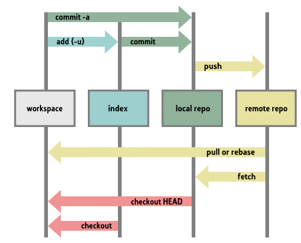

#Introdução

Isso não é um tutorial básico sobre git. Tento atacar as principais dúvidas que me surgiram quando comecei a utilizar o Git: fluxo do git, branch e merge.

Esses dois assuntos eu tento demonstrar com foco no processo de desenvolvimento, não apenas no poder da ferramenta.

#Fluxo Git
Um repositório git não depende de um repositório remoto. Todo o controle das alterações está na sua mão, localmente. Então a primeira dica é ter o fluxo de um repositório git na mente: 


"staging area" or "index"


Fluxo com o repositório remoto


#Branch

git diff b1 b2
git diff --cached
Parte 7 - Git stash

#Merge

Parte 6 - Rebasing

git pull --rebase origin master

```
#!bash
git checkout master
git pull origin master
git checkout b1
git rebase master
```

Troca tudo isso por `git pull --rebase origin master` na própria branch _b1_.


#Processo de desenvolvimento


#Veja também
- Alias
- github.io

#Referências
- Documentação do Git
    - https://git-scm.com/book/en/v2/Git-Basics-Recording-Changes-to-the-Repository
    - https://git-scm.com/about/staging-area
- Tutoriais
    - https://www.sonassi.com/knowledge-base/our-magento-git-guide-and-work-flow/
